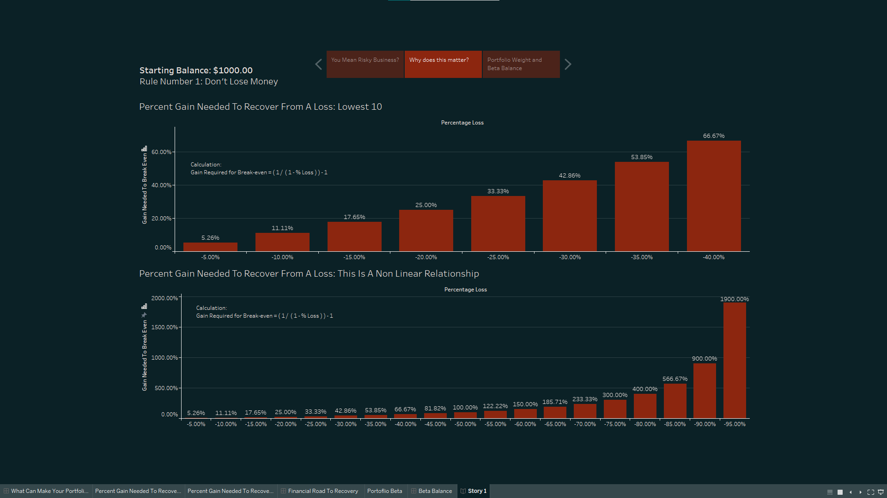
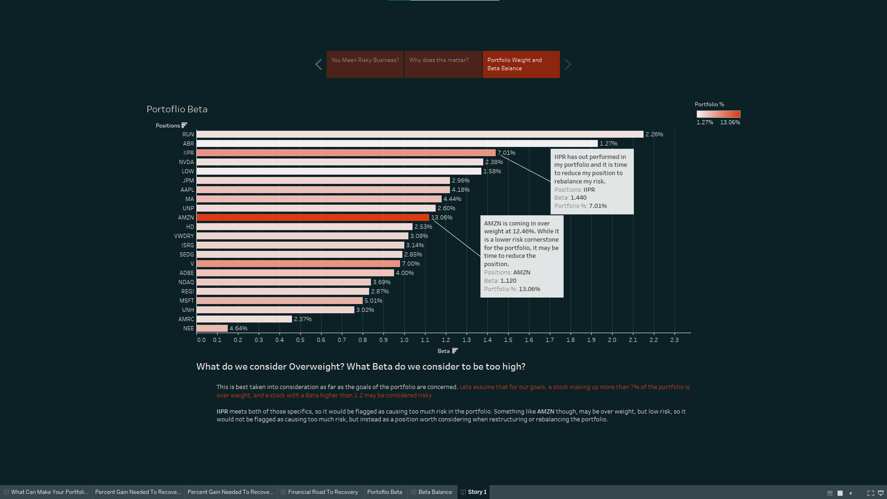

# The benefits of proper risk management

### Key Takeaways 
- The % Gain required to break even from a loss is not linearly correlated
- Out performing stocks can become too heavily weighted and need to be adjusted accordingly
- Beta correlation can give you a sense of the expected return for a portfolio based on the movement of the S&P 500

